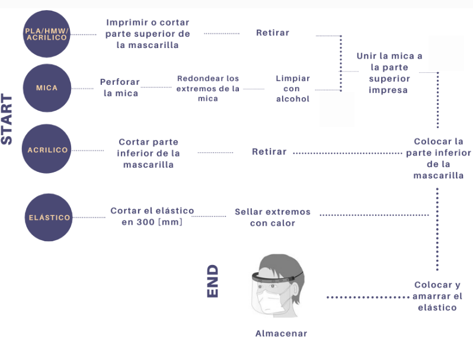

# EPP-COVID19

Fab Lab UTFSM ha estado trabajando en la fabricación de equipamiento de seguridad personal para funcionarios de centros de salud.
Actualmente se están produciendo 200 escudos faciales diarios, con la posibilidad de ampliar a 400 y se han realizado entregar al [Hospital de Maipú](http://www.hospitalelcarmen.cl/hec/), [CESFAM](http://www.laguiadesantiagodechile.com/du/358-la-pincoya-cesfam) y ELEAM de La Pincoya y el [Hospital Clínico de la Universidad de Chile](https://www.redclinica.cl/). 

## Modelos desarrollados

Se han desarrollado dos modelos con el fin de poder trabajar de forma paralela con las maquinas de impresion 3D y corte laser; actualmente se esta trabajando en la incorporacion de la CNC Router, inspirados en el proyecto del [Center of Bits and Atoms](https://gitlab.cba.mit.edu/alfonso/fabshield). 

### Mapa de procesos

#### Materiales

<table>
  <tr>
    <td>Material</td>
    <td>Proveedor</td>
    <td>Contacto</td>
  </tr>
<tr>
     <td>Filamento 3D</td>
    <td>Imperio 3D</td>
    <td>https://imperio3d.com/</td>
</tr>
  <tr>
     <td>Mica</td>
    <td>La Economica</td>
    <td>+562 281543311</td>
</tr>
<tr>
    <td>Elastico</td>
    <td>La Paloma</td>
    <td>+562 28492405</td>
</tr>
<tr>
    <td>Acrilico</td>
    <td>Induacril</td>
    <td>ventas@induacril.cl</td>
</tr>
<tr>
    <td>Alcohol Isopopilico</td>
    <td>Dideval</td>
    <td>info@dideval.cl</td>
</tr>
</table>  

### Impresión 3D

Este modelo esta basado en el trabajo de [Prusa](https://www.prusaprinters.org/prints/25857-prusa-face-shield), y fue modificado por [Javier de la Cerda](https://www.instagram.com/javier.mkr/). En la carpeta [Impresion 3D](https://github.com/FabLabUTFSM/EPP-COVID19/tree/master/Archivos%20Impresion%203D) se entregan los Gcodes para trabajar desde 1 a 50 unidades en una [Ultimaker 3 Extendend](https://ultimaker.com/download/21471/Ultimaker%203%20Extended%20specification%20sheet.pdf), ademas se puede descargar los archivos .stl para poder desarrollar sus propios Gcode. 

 

#### Fabricación

Actualmente existen dos metodos de fabricacion; 1 pieza a la vez, o en torres de 30 piezas que duran 24 horas de impresion:

    

Estos modelos se pueden encontrar en la carpeta [impresion 3D](lala) en este mismo repositorio. Existen dos formas de 

### Corte Laser

Este modelo fue desarrollado por  [Javier de la Cerda](https://www.instagram.com/javier.mkr/) y [Octavio Jaques](https://www.instagram.com/octaviojaques/). 

 

Aqui le enseñare a Javier y a la Pía a documentar, así le pierde el miedo a la programación y el lab se pone mas pro jajaja