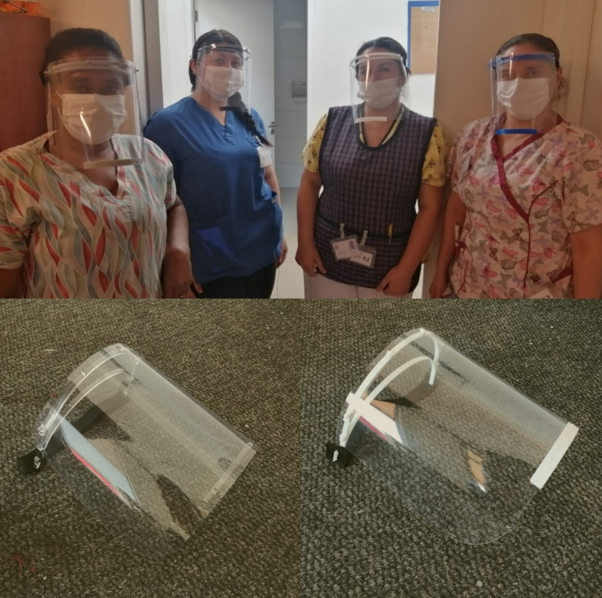
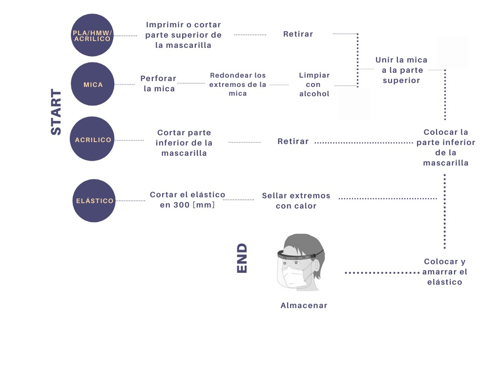
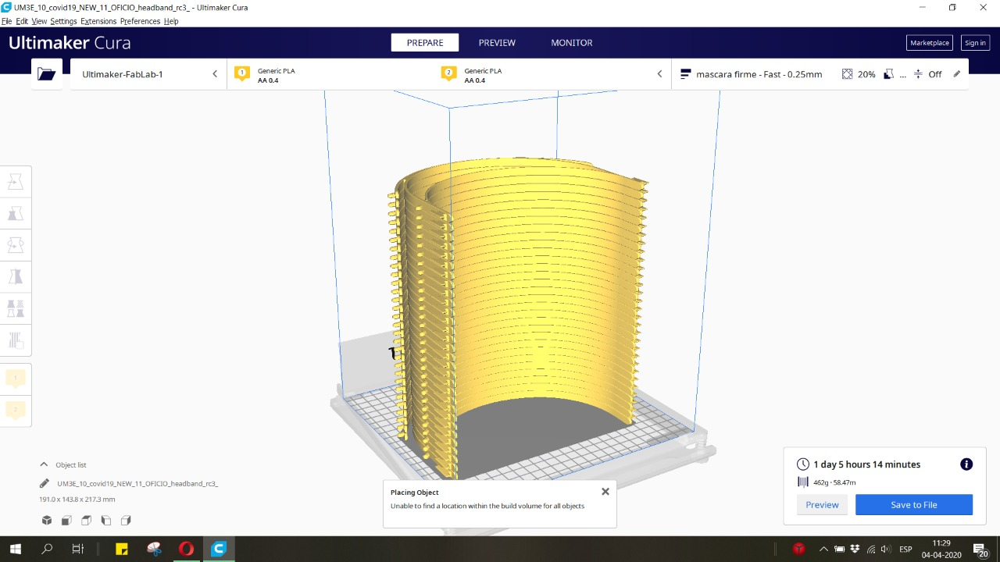
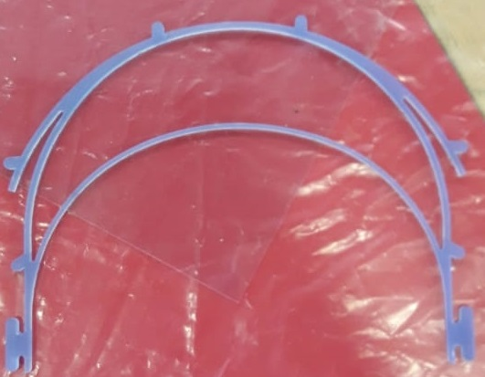
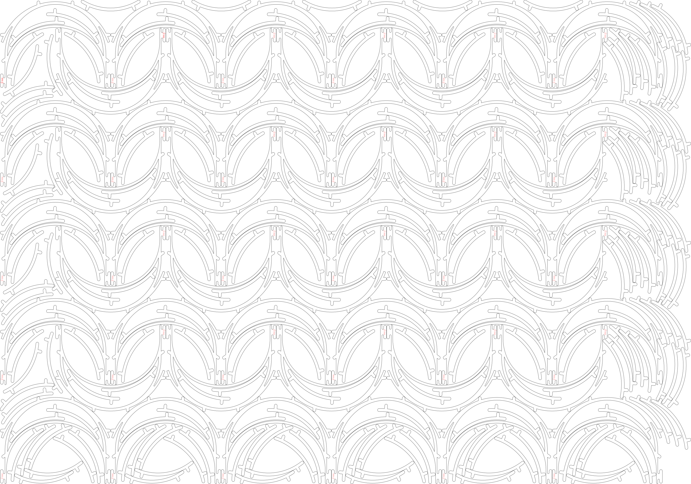

# EPP-COVID19

[Fab Lab UTFSM](http://fablab.usm.cl/) ha estado trabajando en la fabricación de equipamiento de seguridad personal para funcionarios de centros de salud.
Actualmente se están produciendo 200 escudos faciales diarios, con la posibilidad de ampliar a 400 y se han realizado entregar al [Hospital de Maipú](http://www.hospitalelcarmen.cl/hec/), [CESFAM](http://www.laguiadesantiagodechile.com/du/358-la-pincoya-cesfam) y ELEAM de La Pincoya y el [Hospital Clínico de la Universidad de Chile](https://www.redclinica.cl/). 

 

## Modelos desarrollados

Se han desarrollado dos modelos con el fin de poder trabajar de forma paralela con las máquinas de impresión 3D y corte laser; actualmente se está trabajando en la incorporación de la CNC Router.
### Mapa de procesos

#### Materiales

<table>
  <tr>
    <td>Material</td>
    <td>Proveedor</td>
    <td>Contacto</td>
  </tr>
<tr>
     <td>Filamento 3D</td>
    <td>Imperio 3D</td>
    <td>https://imperio3d.com/</td>
</tr>
  <tr>
     <td>Mica</td>
    <td>La Económica</td>
    <td>+562 281543311</td>
</tr>
<tr>
    <td>Elastico</td>
    <td>La Paloma</td>
    <td>+562 28492405</td>
</tr>
<tr>
    <td>Acrílico</td>
    <td>Induacril</td>
    <td>ventas@induacril.cl</td>
</tr>
<tr>
    <td>Alcohol Isopopilico</td>
    <td>Dideval</td>
    <td>info@dideval.cl</td>
</tr>
</table>  

### Impresión 3D

 

Este modelo está basado en el trabajo de [Prusa](https://www.prusaprinters.org/prints/25857-prusa-face-shield), y fue modificado por [Javier de la Cerda](https://www.instagram.com/javier.mkr/). 

La principal ventaja de la impresión 3D es que se pueden imprimir 30 piezas a la vez, entregando una mayor independencia a las personas que trabajan en la construcción de las máscaras, sin embargo, son más lentas que producir que las cortadas en laser. 

Todos los GCode están fueron hechos para una [Ultimaker 3 Extendend](https://ultimaker.com/download/21471/Ultimaker%203%20Extended%20specification%20sheet.pdf) y pueden ser encontrados en la carpeta [Impresión 3D](https://github.com/FabLabUTFSM/EPP-COVID19/tree/master/Archivos%20Impresion%203D), donde archivos para imprimir desde 1 a 30 unidades, con tiempos de impresión que van desde 1 a 30 horas.

#### Fabricación

En caso de que el usuario no tenga la misma máquina, se entregan los archivos .stl para que el usuario pueda construir sus propios GCode, a continuación, se presentan los parámetros claves. 

  

##### Parámetros claves

<table>
  <tr>
    <td>Altura de capa</td>
    <td>0.25 </td>
  </tr>
<tr>
     <td> Perímetros </td>
    <td>3 </td>
</tr>
  <tr>
     <td>Capas superior e inferior </td>
    <td>4</td>
</tr>
<tr>
    <td>Velocidad de impresión [mm/s]</td>
    <td>80 </td>
</tr>
<tr>
    <td>Brim </td>
    <td>off</td>
</tr>
</table> 

### Corte Laser

Con el fin de poder tener modelos más rápidamente al momento es que [Javier de la Cerda](https://www.instagram.com/javier.mkr/) y [Octavio Jaques](https://www.instagram.com/octaviojaques/), desarrollaron archivos vectoriales reduciendo los tiempos de fabricación por pieza de 1 hora por pieza a 1.5 minutos.  

En esta máquina se cortan 2 piezas, el cintillo y la barbilla, estas son utilizadas tanto en los escudos faciales fabricados mediante impresión 3D y corte laser:

- Cintillo:  

- Barbilla: 

#### Fabricación

El objetivo es optimizar el uso de material, distribuyendo las piezas a cortar de forma tal que la perdida de material sea lo minimo posible.   

Estos archivos se pueden encontrar en la carpeta [Archivos Corte Laser](https://github.com/FabLabUTFSM/EPP-COVID19/tree/master/Archivo%20Corte%20Laser) se encontrarán archivos vectoriales 
para ambos modelos, y distribuciones para las maquinas presentes en Fab Lab UTFSM [Bodor](https://www.novakon.net/products/bcl-1309x-laser-cutting-engraving-machine) y [GCC X252](https://www.gccworld.com/goods.php?act=view&no=24). 

#### Parámetros claves de fabricación

<table>
  <tr>
    <td>Bodor</td>
    <td></td>
  </tr>
<tr>
     <td> Potencia </td>
    <td> 70 </td>
</tr>
  <tr>
     <td> Velocidad </td>
    <td> 20 </td>
</table> 

**Importante**: Todos estos archivos fueron desarrollados para planchas de acrílico con un espesor de 5 mm.

